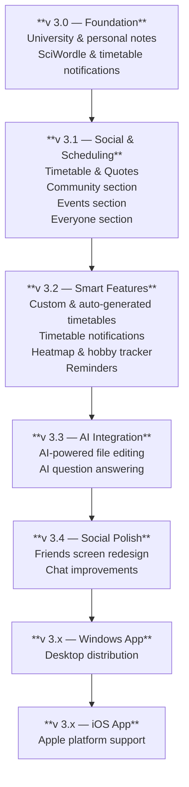

```mermaid
flowchart TD

  V30["**v 3.0 — Foundation**\nUniversity & personal notes\nSciWordle & timetable notifications"]
  V31["**v 3.1 — Social & Scheduling**\nTimetable & Quotes\nCommunity section\nEvents section\nEveryone section"]
  V32["**v 3.2 — Smart Features**\nCustom & auto-generated timetables\nTimetable notifications\nHeatmap & hobby tracker\nReminders"]
  V33["**v 3.3 — AI Integration**\nAI-powered file editing\nAI question answering"]
  V34["**v 3.4 — Social Polish**\nFriends screen redesign\nChat improvements"]
  VXW["**v 3.x — Windows App**\nDesktop distribution"]
  VXI["**v 3.x — iOS App**\nApple platform support"]

  V30 --> V31 --> V32 --> V33 --> V34 --> VXW --> VXI
```
