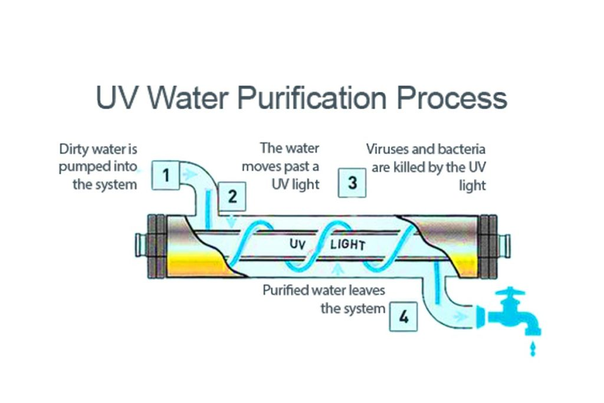
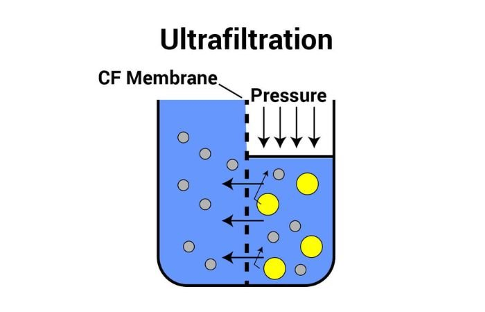
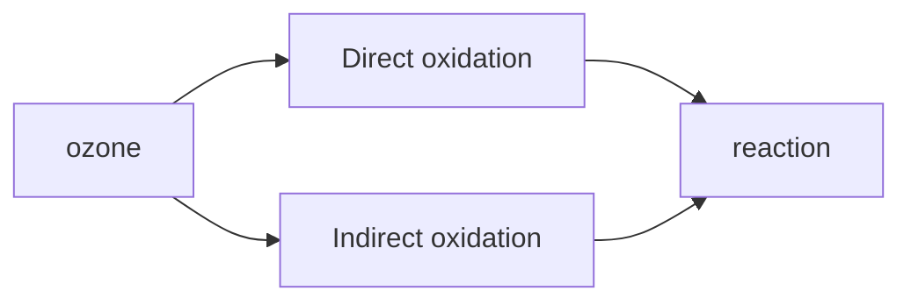

# Disinfection Methods

> [!abstract] What is Disinfection?
> Disinfection is the process of **killing or inactivating harmful microorganisms**(bacteria, viruses, fungi, protozoa) in water to make it safe for human use. **It does not remove physical impurities** — only neutralizes biological threats.
****
---

## 1. UV Purification (e-Boiling)

**What it is:** A method that uses ultraviolet light to destroy germs in water.

**How it works:**
- Water passes through a chamber containing a **mercury lamp**
- The lamp emits **short-wave UV radiation**
- This radiation **penetrates the cells** of bacteria and viruses
- It destroys their ability to **reproduce** → the microbes eventually die
- Destroys approximately **99.99%** of harmful organisms

**Key idea:** UV does not kill germs chemically — it disables their DNA so they
cannot multiply.

> [!warning] Important Limitation
> UV only *inactivates* germs. Their **dead bodies remain in the water**.
> Separate filters (RO or activated carbon) are needed to physically remove them. UV is therefore almost always used **alongside other filtration methods**.

---

## 2. Ultra filtration (UF)

**What it is:** A physical filtration method that uses a membrane with very tiny
pores to block impurities.

**How it works:**
- Water is pushed through a **membrane with pore size 0.01 – 0.1 µm**
- The membrane acts as a **physical barrier**
- It blocks: colloidal impurities, pathogenic organisms, turbidity
- It **cannot remove** dissolved solids and salts (unlike RO)

**Key idea:** Think of it as an extremely fine sieve — anything larger than the
pore size simply cannot pass through.

> [!tip] When to prefer UF over RO
> If the water's **TDS (Total Dissolved Solids) is less than 500 mg/L**,
> UF-based purifiers are preferred over RO, since RO unnecessarily removes essential minerals at low TDS levels.

---

## 3. Ozonolysis

**What it is:** A disinfection method that uses **ozone gas (O₃)** — a highly
reactive form of oxygen — breaks cell walls/membranes of bacteria, viruses, and protozoa, rendering them inactive.

**How it works — two pathways:**

### Direct Oxidation
Ozone molecules directly attack contaminants — breaking the **chemical bonds** of bacteria.

### Indirect Oxidation (Hydroxyl Radicals)
Ozone decomposes in water to produce **hydroxyl radicals (·OH)**,
which are even *more* reactive than ozone itself.

$$\text{O}_3 + \text{H}_2\text{O} \rightarrow 2\text{OH}^\cdot + \text{O}_2$$
_·OH = hydroxyl radical, highly reactive_
These radicals can oxidize a far wider range of pollutants.

_for reference_

---
**Key Reactions:**

$$2\text{Fe}^{2+} + \text{O}_3 + 5\text{H}_2\text{O} \rightarrow 2\text{Fe(OH)}_3 + \text{O}_2$$

$$\text{O}_3 + \text{Bacteria} \rightarrow \text{Inactive Products}$$

**Applications:**

- **Drinking Water** — removes taste, odor, color; disinfects pathogens
- **Wastewater Treatment** — reduces BOD/COD by breaking down organic pollutants; removes pharmaceuticals and endocrine disruptors
- **Industrial Water Recycling** — oxidizes cooling tower contaminants; reclaims process water
