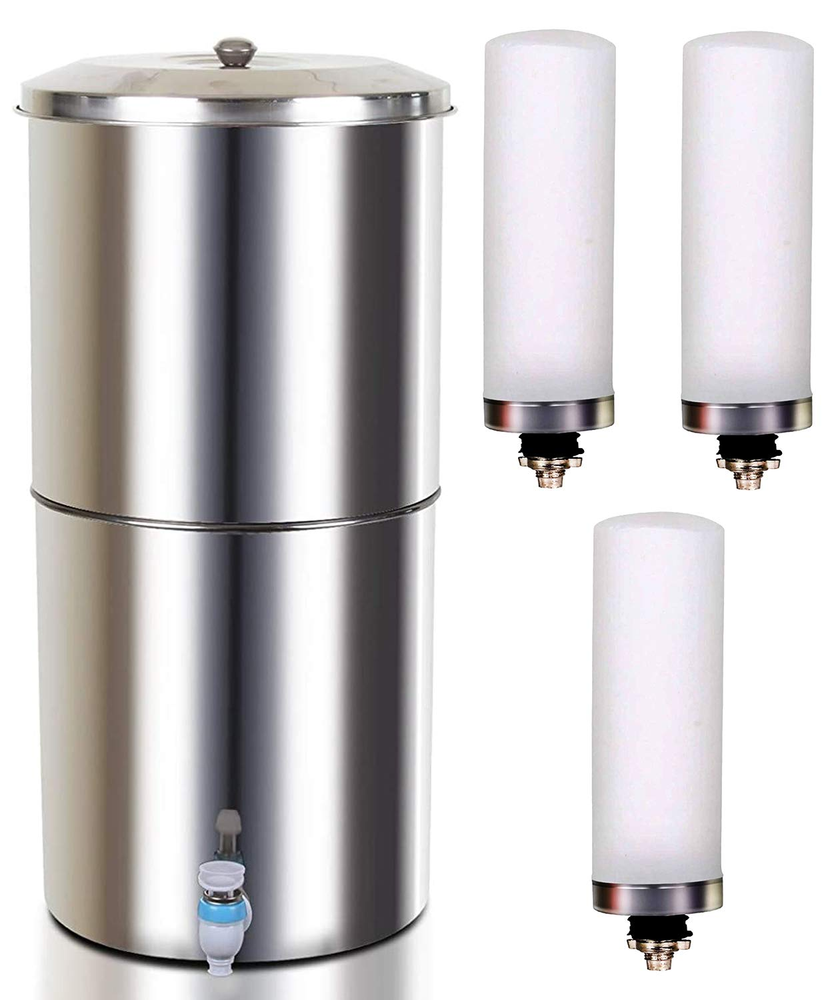
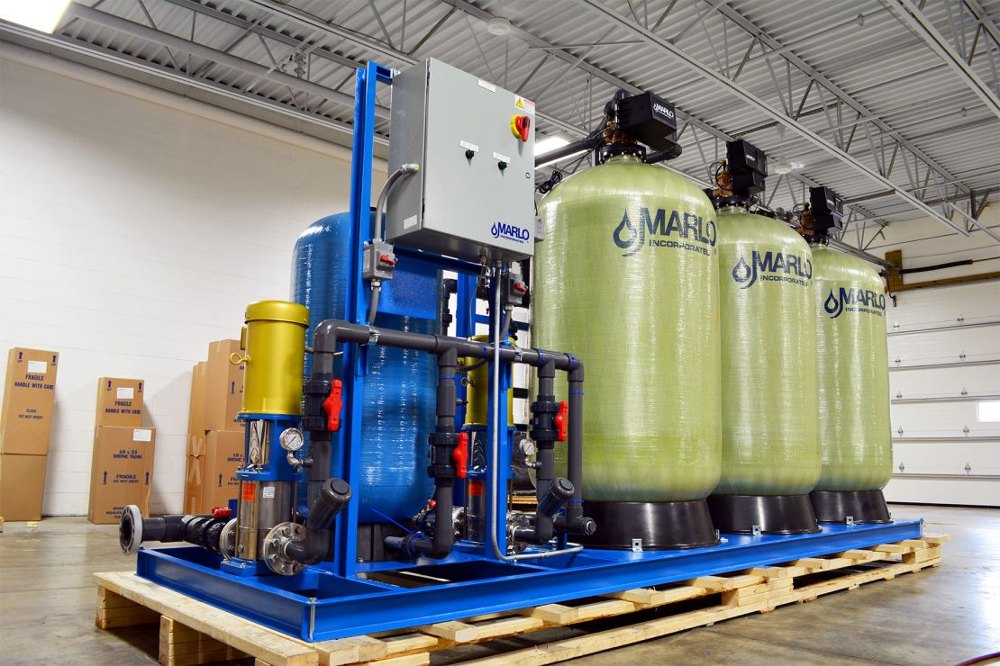

#### Water Filtration Methods

## Candle Filtration

> [!info] Mechanism
> Water passes through a candle-shaped filter with very minute pores (generally **< 3 μm**). Any particle larger than the pore size is physically blocked.

### Advantages
- Simple operating mechanism
- No electricity required

### Disadvantages
- Cannot remove **soluble contaminants** (e.g. arsenic, fluoride)
- Cannot remove **bacteria** → water must still be boiled before consumption
- Candle requires **frequent cleaning** for effective operation
- **Slow filtration rate** → mechanized systems are preferred for reliability

### Suitable For
- Removing **suspended solids**

---

## Activated Carbon Filtration

> [!info] Mechanism
> Uses activated carbon filters to adsorb chemical impurities from water.

### Advantages
- Removes chemicals: **chlorine, pesticides, and other impurities**
- Improves **taste and odour** of water
- No electricity required

### Disadvantages
- **Not effective** at removing microbes
- Conventional carbon filters are a **breeding ground for microbes**

### Modern Improvement
- **Nano-silver coated carbon** is now used by most commercial filter suppliers to address microbial growth

### Suitable For
- Removing chemical contaminants and improving sensory quality

---

## Comparison Table

| Property                 | Candle Filter     | Activated Carbon     |
| ------------------------ | ----------------- | -------------------- |
| Removes suspended solids | ✅                 | ❌                    |
| Removes chemicals        | ❌                 | ✅                    |
| Removes bacteria         | ❌                 | ❌                    |
| Needs electricity        | ❌                 | ❌                    |
| Maintenance              | Frequent cleaning | Replace/clean filter |
