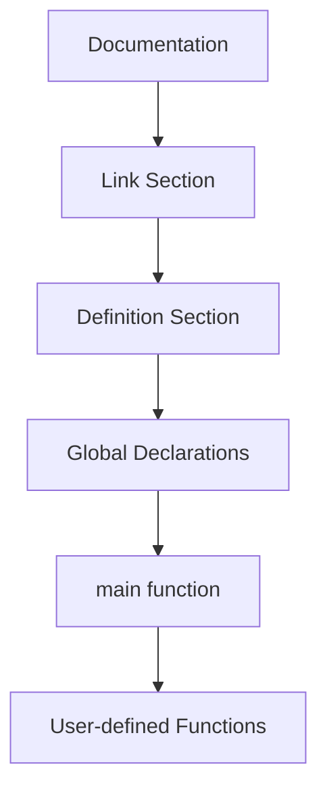

The structure of a C program refers to the standard sections used to write a valid program.

## Basic Structure

1. Documentation section
2. Link section
3. Definition section
4. Global declaration section
5. `main()` function
6. User-defined functions

## Example Program

```c
/* Program to display a message */
#include <stdio.h>
#define MSG "Welcome to C"

int value = 10;

int main() {
    printf("%s\n", MSG);
    printf("Value = %d\n", value);
    return 0;
}
```

## Explanation

- Documentation section: comments describing the program.
- Link section: header files like `#include <stdio.h>`.
- Definition section: symbolic constants using `#define`.
- Global declarations: variables or function declarations used across functions.
- `main()`: starting point of execution.
- User-defined functions: additional functions written by the programmer.

## Overview 
dont write in exam, this is for your understiandggskdf


