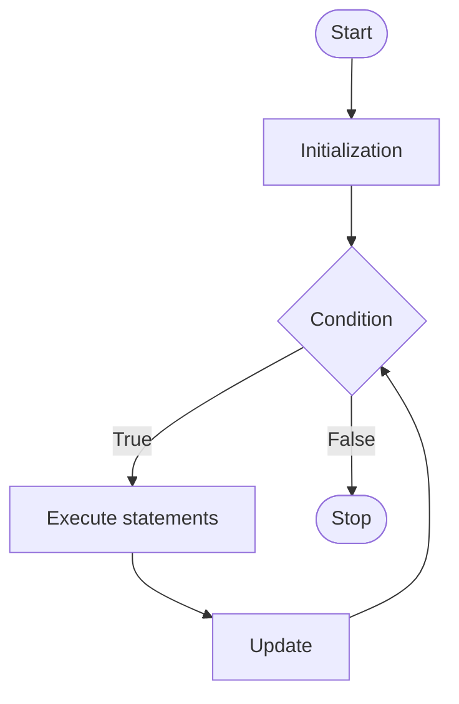

The `for` loop is used when the number of iterations is known in advance.

## Syntax

```c
for (initialization; condition; update) {
    statements;
}
```

## Flowchart



## Example Program

```c
#include <stdio.h>

int main() {
    int i;
    for (i = 1; i <= 5; i++) {
        printf("%d\n", i);
    }
    return 0;
}
```
