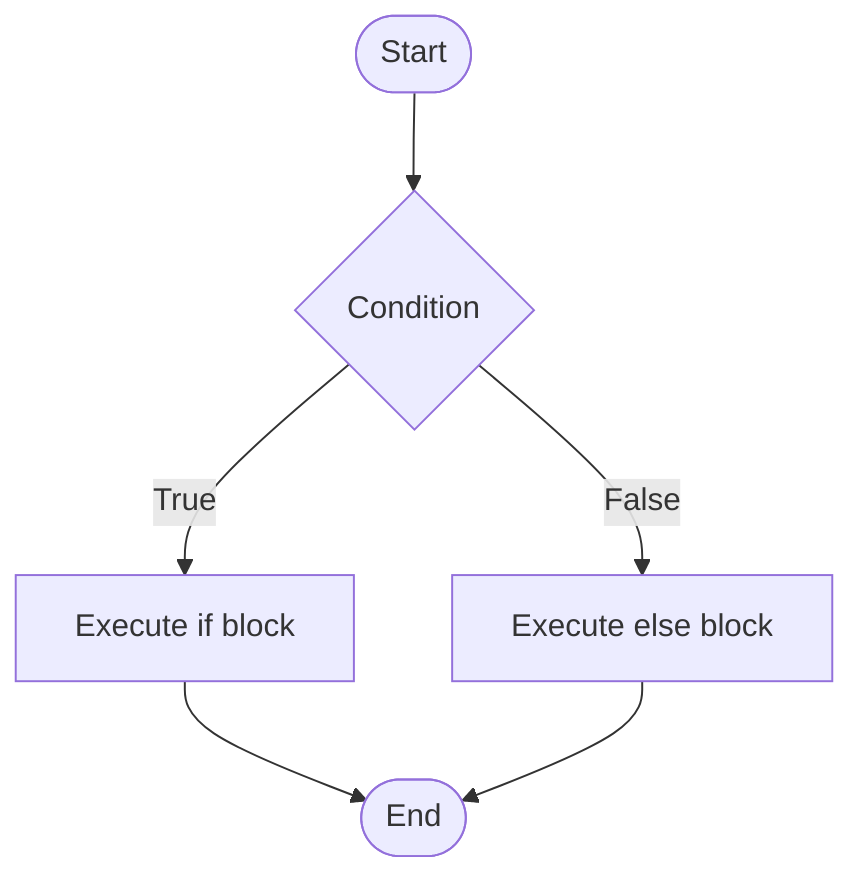

The `if` statement is used to execute a block only when a condition is true. The `if-else` statement chooses between two blocks based on a condition.

## Syntax of `if`

```c
if (condition) {
    statements;
}
```

## Syntax of `if-else`

```c
if (condition) {
    statements1;
} else {
    statements2;
}
```

## Flowchart



## Example Program

```c
#include <stdio.h>

int main() {
    int marks;
    printf("Enter marks: ");
    scanf("%d", &marks);

    if (marks >= 50) {
        printf("Pass\n");
    } else {
        printf("Fail\n");
    }
    return 0;
}
```


`if` is used for one-way selection, and `if-else` is used for two-way selection.
