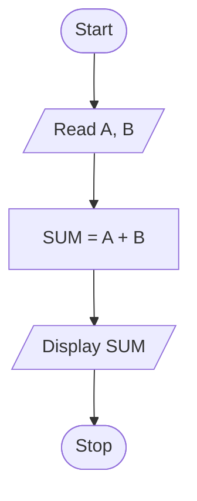

# Algorithm

An algorithm is a step-by-step procedure or sequence of instructions used to solve a problem. It takes some **input**, processes it through a set of instructions, and produces the required **output**.

Key points about algorithms: they receive input, contain a sequence of statements to solve a problem using given data, and are completely **language independent** — the same algorithm can be implemented in C, C++, Java, or any other language.

---

## Characteristics of an Algorithm

**1. Clear & Unambiguous** — Every step must be precisely and clearly stated with no room for confusion or misunderstanding about what to do.

**2. Well-defined Inputs** — An algorithm must have clearly specified data that is provided *before* the algorithm starts executing.

**3. Well-defined Outputs** — After processing the inputs through a sequence of statements, the algorithm must produce a well-defined output that depends on the input values.

**4. Finiteness** — The algorithm must always terminate after a **finite number of steps**. It should never run infinitely.

**5. Feasible** — The algorithm should be simple and practical, and should not use overly complex operations.

**6. Language Independent** — An algorithm doesn't depend on any specific programming language like C, C++, or Java. It is written in a generalized manner and can be implemented in any language.

---

## Simple Example

Algorithm to find the sum of two numbers:

1. Start
2. Read `A` and `B`
3. Compute `SUM = A + B`
4. Display `SUM`
5. Stop

## example 

