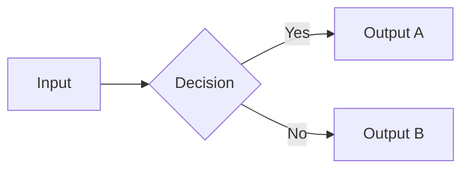
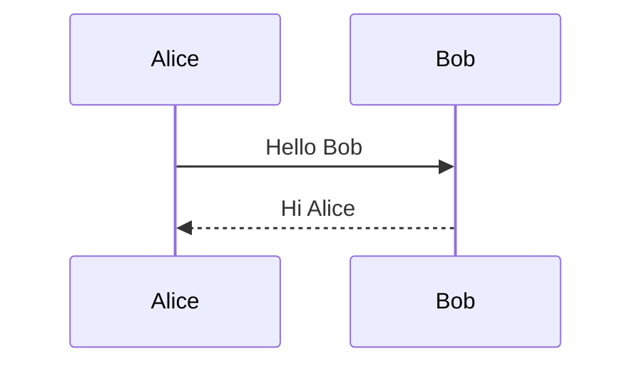
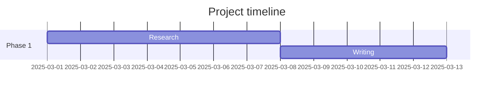

# Obsidian feature test — master template

> [!NOTE] About this note
> This note tests every major Obsidian feature. Sections are self-contained.

---

## 1. Headings hierarchy

# H1 — top level
## H2 — section
### H3 — subsection
#### H4 — detail
##### H5 — fine detail
###### H6 — smallest

---

## 2. Text formatting

Regular paragraph text.  
Line break using double space.

**Bold text** and *italic text* and ***bold italic***.  
~~Strikethrough~~ and ==highlighted text== and `inline code`.  
Subscript: H~2~O — Superscript: E = mc^2^

---

## 3. Lists

### Unordered
- Item one
  - Nested item
    - Deeply nested
- Item two
- Item three

### Ordered
1. First
2. Second
   3. Sub-item
4. Third

### Task list
- [x] Completed task
- [ ] Pending task
- [/] In-progress task
- [-] Cancelled task

---

## 4. Blockquotes

> Single level quote.

> Nested quote level one
>> Level two nested

---

## 5. Code blocks

### Inline
Use `console.log()` to debug.

### Fenced block
```python
def greet(name: str) -> str:
    return f"Hello, {name}"

print(greet("Obsidian"))
```
```bash
git add .
git commit -m "feat: add template"
git push origin main
```

---

## 6. Tables

| Feature       | Status   | Notes                    |
| ------------- | -------- | ------------------------ |
| Wikilinks     | Working  | Core feature             |
| Dataview      | Plugin   | Requires community plugin|
| Canvas        | Working  | Built-in since v1.1      |
| Templates     | Working  | Core plugin              |

---

## 7. Horizontal rules

---
***
___

---

## 8. Links

### Internal wikilinks
[[Another Note]]  
[[Another Note|Custom display text]]  
[[Another Note#Heading|Link to heading]]  
[[Another Note^block-id|Link to block]]

### External links
[Obsidian official site](https://obsidian.md)  
[Obsidian forum](https://forum.obsidian.md)

### Embedded note
![[Another Note]]

### Embedded heading
![[Another Note#Heading]]

---

## 9. Images and embeds

### Local image
![[my-image.png]]  
![[my-image.png|300]]

### External image


### PDF embed
![[document.pdf]]

### Audio embed
![[recording.mp3]]

---

## 10. Footnotes

Here is a sentence with a footnote.[^1]  
Another sentence with an inline footnote.^[This is the inline footnote text.]

[^1]: This is the footnote definition at the bottom.

---

## 11. Math (LaTeX)

Inline math: $E = mc^2$

Block math:
$$
\int_0^\infty e^{-x^2} dx = \frac{\sqrt{\pi}}{2}
$$

$$
F = BIL \quad \text{(Lorentz force)}
$$

---

## 12. Callouts

> [!NOTE]
> Standard note callout.

> [!TIP] Useful tip
> Use `Ctrl+P` to open the command palette.

> [!WARNING] Caution
> Always back up your vault before major changes.

> [!DANGER] Critical
> This action cannot be undone.

> [!INFO] Information
> Callouts support custom titles.

> [!SUCCESS] Done
> Task completed successfully.

> [!QUESTION] Open question
> What is the best folder structure for this vault?

> [!ABSTRACT] Summary
> Callouts are foldable — click the title to collapse.

> [!EXAMPLE] Example
> Here is a worked example.

> [!QUOTE] Quote
> "An idea that is not dangerous is unworthy of being called an idea at all." — Oscar Wilde

> [!NOTE]- Foldable callout (starts collapsed)
> This content is hidden by default.

---

## 13. Tags

#template #test #obsidian #study #engineering

---

## 14. Frontmatter / metadata access

The title of this note is: `= this.title`  
Status: `= this.status`  
Date created: `= this.date`

---

## 15. Dataview queries (requires Dataview plugin)

### Inline query
`= this.tags`

### Table query
```dataview
TABLE title, status, date
FROM #study
SORT date DESC
```

### Task query
```dataview
TASK
FROM "Projects"
WHERE !completed
```

### List query
```dataview
LIST
FROM #engineering
SORT file.name ASC
```

---

## 16. Templater syntax (requires Templater plugin)

Created: <% tp.file.creation_date("YYYY-MM-DD") %>  
Modified: <% tp.file.last_modified_date("YYYY-MM-DD HH:mm") %>  
Note title: <% tp.file.title %>  
Cursor position: <% tp.file.cursor() %>

---

## 17. Block references

A paragraph with a block ID. ^block-ref-test

---

## 18. Mermaid diagrams




---

## 19. Canvas (external link)

[[My Canvas.canvas]]

---

## 20. Properties / YAML types test
```yaml
---
string_field: "Hello"
number_field: 42
boolean_field: true
list_field:
  - item one
  - item two
date_field: 2025-03-15
datetime_field: 2025-03-15T09:00:00
---
```

---

## 21. Aliases usage

This note has aliases defined in frontmatter: `feature-test` and `obsidian-template`.  
You can link to it with [[feature-test]] or [[obsidian-template]].

---

## 22. CSS classes (via cssclasses)

This note uses `wide-page` class in frontmatter, which can be targeted with a custom CSS snippet.

---

*End of template — all features covered.*
